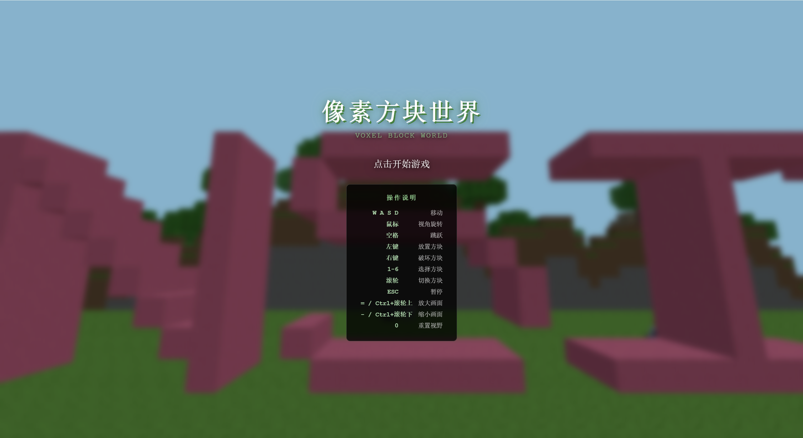
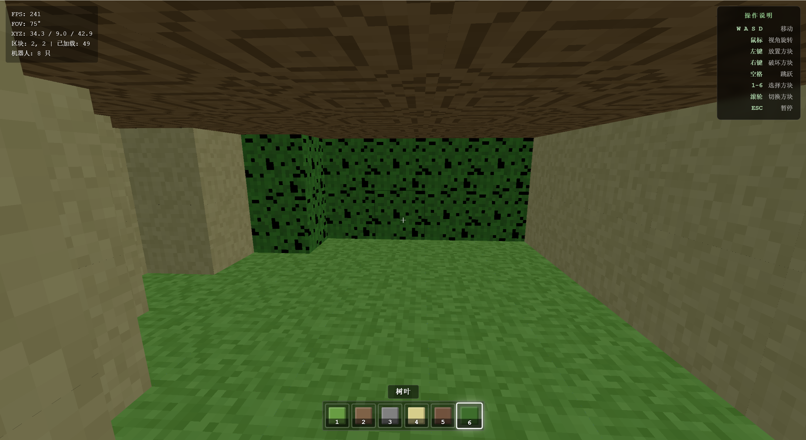
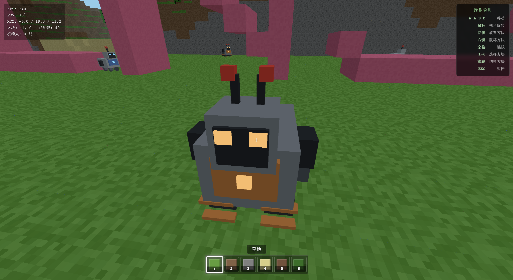

# 像素方块世界 (Voxel Block World)

🎮 一个基于 Three.js 的 3D 像素风格方块世界探索游戏

## 项目简介

这是一个使用原生 Web 技术构建的 3D 体素游戏，玩家可以在无限生成的方块世界中探索、建造和冒险。游戏支持桌面端和移动端，提供流畅的游戏体验。

## 功能特性

- 🎲 **无限地形生成** - 基于 Simplex 噪声算法生成自然地形
- 🏗️ **方块建造系统** - 支持多种方块类型的放置与破坏
- 🤖 **AI 机器人** - 侦察机器人和重型机器人在世界中巡逻
- 🎨 **像素风格** - 经典的 16x16 像素纹理设计
- 📱 **跨平台支持** - 桌面端键鼠操作 + 移动端触控操作

## 游戏预览

### 游戏界面



### 方块建造



### 机器人 NPC



### Coze 立墙


> 📷 **如何添加截图**：
> 1. 运行游戏：`python -m http.server 5000`
> 2. 访问 `http://localhost:5000` 启动游戏
> 3. 截取游戏画面（按 `PrintScreen` 或使用截图工具）
> 4. 将截图保存到 `screenshots/` 目录，命名为 `game.png`, `build.png`, `robot.png`, `coze.png`
> 5. 提交并推送：`git add screenshots/ && git commit -m "Add screenshots" && git push`

## 操作说明

### 桌面端

| 操作 | 功能 |
|------|------|
| W/A/S/D | 移动 |
| 鼠标移动 | 视角旋转 |
| 空格 | 跳跃 |
| 左键 | 放置方块 |
| 右键 | 破坏方块 |
| 1-6 / 滚轮 | 切换方块类型 |
| ESC | 暂停 |
| = / Ctrl+滚轮上 | 放大画面 |
| - / Ctrl+滚轮下 | 缩小画面 |
| 0 | 重置视野 |

### 移动端

| 操作 | 功能 |
|------|------|
| 左下摇杆 | 移动 |
| 右侧滑动 | 视角旋转 |
| 「跳」按钮 | 跳跃 |
| 「放」按钮 | 放置方块 |
| 「拆」按钮 | 破坏方块 |
| 底部物品栏 | 切换方块类型 |

## 技术栈

- **渲染引擎**: Three.js r160
- **语言**: JavaScript (ES Module)
- **样式**: 原生 CSS
- **构建**: 无需构建步骤

## 快速开始

### 本地运行

```bash
# 进入项目目录
cd projects

# 启动本地服务器
python -m http.server 5000

# 或使用 Node.js
npx http-server -p 5000
```

然后在浏览器中访问 `http://localhost:5000`

### 在线体验

访问 GitHub Pages: [https://evedensity.github.io/MineWorld/](https://evedensity.github.io/MineWorld/)

## 项目结构

```
projects/
├── index.html          # 游戏入口页面
├── styles/
│   └── main.css        # 游戏界面样式
└── js/
    ├── game.js         # 游戏主模块：玩家控制、物理系统、游戏循环
    ├── voxel.js        # 核心引擎：方块定义、区块管理、世界生成
    ├── noise.js        # Simplex 噪声生成器
    └── animals.js      # 机器人实体系统
```

## 方块类型

| 方块 | 类型 | 说明 |
|------|------|------|
| 🌿 草地 | GRASS | 地表方块 |
| 土 壤 | DIRT | 草地下方 |
| 🪨 石头 | STONE | 地下岩石 |
| 🏖️ 沙子 | SAND | 海滩区域 |
| 🪵 木头 | WOOD | 树干 |
| 🍃 树叶 | LEAVES | 树冠 |
| 💧 水 | WATER | 水域 |
| 🌸 花朵 | FLOWER | 装饰植物 |
| 🍄 蘑菇 | MUSHROOM | 装饰植物 |

## 性能优化

- ✅ 面剔除：仅渲染暴露的方块面
- ✅ 区块系统：16x48x16 区块合并渲染
- ✅ 动态加载：只加载玩家周围的区块
- ✅ 增量生成：每帧最多生成 2 个区块
- ✅ 雾效遮挡：隐藏区块加载边界

## 许可证

MIT License

---

## 特别声明

本项目的灵感来源于字节跳动的 Coze 项目，代码仅用于学习和分享目的，未用于商业用途。

如果本项目存在任何侵权问题，请通过 GitHub Issues 联系我，我会在第一时间删除相关内容。

**项目地址**: [https://github.com/EVEDensity/MineWorld](https://github.com/EVEDensity/MineWorld)